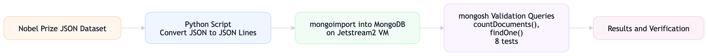

# NoSQL-Document-Storage-for-Semi-Structured-Data-using-Nobel-Prize-Dataset

**Author:** Khushi Shah  
**Course:** INFO-I535 – Big Data Concepts  
**Module:** Ingest & Storage (NoSQL)

## Project summary

This project demonstrates how a NoSQL document database can store and query semi-structured JSON data. The workflow uses MongoDB on a Jetstream2 VM to ingest the Nobel Prize dataset, convert it into JSON Lines format, load it into a collection, and run a small set of validation queries that show how document storage handles nested arrays, variable-length fields, and schema-on-read behavior.

## Dataset

Official Nobel Prize API dataset (developer zone):
https://www.nobelprize.org/about/developer-zone-external-resources-and-examples/

The dataset used in this project is public and contains prize records with nested laureate objects, arrays, and motivation text. It is a strong fit for a document database because the structure is not flat and varies by record.

## Reproducibility at a glance

1. Launch a Jetstream2 VM (Ubuntu 22.04, m3.tiny was used here).
2. Install MongoDB Community Edition.
3. Download the Nobel Prize JSON dataset.
4. Convert the dataset to JSON Lines format.
5. Import the JSON Lines file into MongoDB with `mongoimport`.
6. Validate ingestion with `mongosh`.
7. Run the eight queries below to reproduce the results.
8. Stop or delete the VM when finished.

---

## 1. Environment

- **Platform:** Jetstream2 VM
- **OS:** Ubuntu 22.04
- **Instance size:** m3.tiny
- **Database:** MongoDB Community Edition
- **Shell/tools:** `mongoimport`, `mongosh`, Python 3 `json` module

### Architecture / workflow



## 2. Data description

Each Nobel Prize record includes:

- `year` (string)
- `category` (string)
- `laureates` (array of embedded objects)

Each laureate object can contain:

- `id`
- `firstname`
- `surname`
- `motivation`
- `share`

The nested array structure is what makes the dataset ideal for document storage.

---

## 3. Step-by-step setup

### Step 1: Download and inspect the source JSON

The original dataset is structured as a top-level object containing a `prizes` array. That format is useful for APIs, but `mongoimport` works best with one JSON document per line.

### Step 2: Convert JSON to JSON Lines

Use this Python script to convert the original file into a JSON Lines file named `nobel_mongo.json`.

```python
import json

with open('/content/nobel_prize.json', 'r') as f:
    data = json.load(f)

with open('nobel_mongo.json', 'w') as out:
    for prize in data['prizes']:
        json.dump(prize, out)
        out.write('\n')
```

### Step 3: Import the data into MongoDB

Run `mongoimport` to load the JSON Lines file into a database called `nobel_db` and a collection called `prizes`.

```bash
mongoimport \
  --db nobel_db \
  --collection prizes \
  --file nobel_mongo.json
```

### Step 4: Validate the ingestion

Use `mongosh` to confirm the record count and check one sample document.

```javascript
use nobel_db

db.prizes.countDocuments()   // confirm total record count

db.prizes.findOne()          // inspect document structure
```

### Step 5: Run the validation queries

The results section of the report is based on the following eight queries.

---

## 4. Query set

### Q1: Count of prizes by category

```javascript
db.prizes.aggregate([
  { $group: { _id: '$category', totalPrizes: { $sum: 1 } } },
  { $sort: { totalPrizes: -1 } }
])
```

### Q2: Count of laureates by category

```javascript
db.prizes.aggregate([
  { $unwind: '$laureates' },
  { $group: { _id: '$category', totalLaureates: { $sum: 1 } } },
  { $sort: { totalLaureates: -1 } }
])
```

### Q3: Most recent prize year per category

```javascript
db.prizes.aggregate([
  { $sort: { year: -1 } },
  { $group: { _id: '$category', latestYear: { $first: '$year' } } }
])
```

### Q4: Laureates with `development` in motivation text

```javascript
db.prizes.find(
  { 'laureates.motivation': /development/i },
  { year: 1, category: 1, 'laureates.firstname': 1, 'laureates.surname': 1 }
)
```

### Q5: Prize count by decade

```javascript
db.prizes.aggregate([
  { $addFields: { decade: { $subtract: [
      { $toInt: '$year' },
      { $mod: [ { $toInt: '$year' }, 10 ] }
  ] } } },
  { $group: { _id: '$decade', count: { $sum: 1 } } },
  { $sort: { _id: 1 } }
])
```

### Q6: Laureates with surnames starting with `K`

```javascript
db.prizes.aggregate([
  { $unwind: '$laureates' },
  { $match: { 'laureates.surname': /^K/i } },
  { $project: { _id: 0, year: 1, category: 1,
      firstname: '$laureates.firstname',
      surname: '$laureates.surname' } }
])
```

### Q7: Laureate appearance count (repeat winners)

```javascript
db.prizes.aggregate([
  { $unwind: '$laureates' },
  { $group: { _id: { id: '$laureates.id',
      firstname: '$laureates.firstname',
      surname: '$laureates.surname' },
      appearances: { $sum: 1 } } },
  { $sort: { appearances: -1 } }
])
```

### Q8: All prize records for year 2025

```javascript
db.prizes.find(
  { year: '2025' },
  { _id: 0, category: 1, laureates: 1 }
)
```

---

## 5. Validation plan

Validation was done at two levels:

1. **Ingestion validation**
   - `db.prizes.countDocuments()` verified the expected number of records.
   - `db.prizes.findOne()` confirmed that nested arrays and embedded fields were preserved.

2. **Query validation**
   - Aggregation, array unwinding, regex filtering, computed fields, and year filtering were tested.
   - The outputs matched expected Nobel Prize facts, including repeat laureates and the later start of economics prizes.

---

## 6. Cleanup

After the project was complete, the VM was stopped or shelved to avoid unnecessary usage charges and to keep resources tidy.

---

## 7. Notes on course connection

This project focuses on the **Ingest & Storage** module. It explicitly demonstrates:

- semi-structured data
- document storage
- schema-on-read
- nested arrays and embedded objects
- ingestion validation
- simple query-based verification instead of heavy analytics

---

## 8. References

- Cattell, R. (2011). *Scalable SQL and NoSQL data stores*. ACM SIGMOD Record, 39(4), 12–27.
- MongoDB, Inc. (2024). *MongoDB documentation*. https://www.mongodb.com/docs/
- MongoDB, Inc. (2024). *mongoimport documentation*. https://www.mongodb.com/docs/database-tools/mongoimport/
- Nobel Prize Outreach AB. (2024). *Nobel Prize dataset – developer zone*. https://www.nobelprize.org/about/developer-zone-external-resources-and-examples/
- Python Software Foundation. (2024). *Python 3.10 documentation – json module*. https://docs.python.org/3/library/json.html
- Jetstream2 Cloud. (2024). *Jetstream2 user guide and documentation*. https://docs.jetstream-cloud.org/

---

## 9. Suggested folder structure

```text
project/
├── README.md
├── nobel_prize.json
├── nobel_mongo.json
├── readme_assets/
│   ├── page2-02.png
│   ├── page4-04.png
│   ├── page5-05.png
│   ├── page6-06.png
│   └── page7-07.png
└── scripts/
    └── convert_json_to_jsonl.py
```

---

## 10. How to reuse this project

If someone wants to reproduce this exact setup, the only things they need are:

- a Jetstream2 VM or equivalent Linux environment
- MongoDB Community Edition
- the Nobel Prize JSON dataset
- the conversion script
- the import command
- the query set above

That is enough to rebuild the database, verify the structure, and reproduce the report results.
